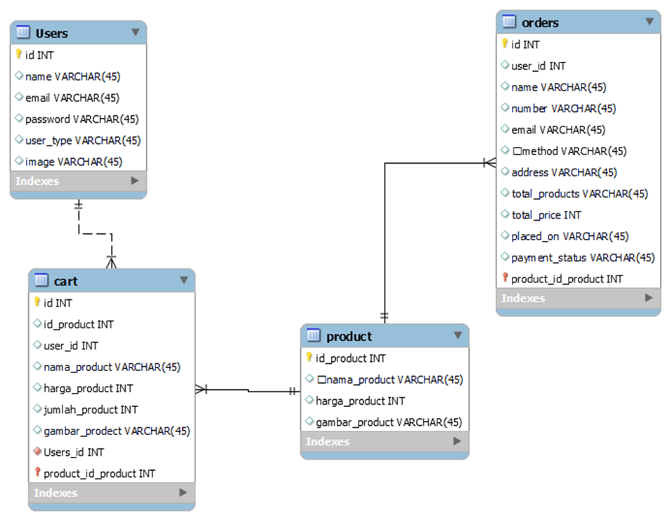

# E-commerce

## Gambaran Umum
Proyek ini merupakan implementasi dari sebuah situs e-commerce sederhana yang dibangun dengan menggunakan bahasa pemrograman PHP secara native. Situs ini dirancang untuk memfasilitasi pengguna dalam berbelanja secara online dengan fitur-fitur dasar seperti menampilkan produk, menambahkan produk ke dalam keranjang belanja, dan menyelesaikan pembelian.

## Tujuan Proyek
Tujuan utama dari proyek ini adalah untuk memenuhi nilai tugas besar mata kuliah Pemrograman Web Dinamis. Melalui proyek ini, diharapkan peserta mampu memahami konsep dasar pengembangan web dinamis serta mampu mengimplementasikannya dalam sebuah proyek nyata.

## Fitur Utama
1. **Tampilan Produk:** Menampilkan daftar produk yang tersedia beserta gambar, deskripsi, dan harga.
2. **Pencarian Produk:** Memungkinkan pengguna untuk mencari produk berdasarkan kata kunci tertentu.
3. **Keranjang Belanja:** Pengguna dapat menambahkan produk ke dalam keranjang belanja mereka.
4. **Pembayaran:** Sistem pembayaran sederhana yang memungkinkan pengguna untuk menyelesaikan pembelian.

## Teknologi yang Digunakan
Proyek ini dibangun menggunakan teknologi sebagai berikut:
- **Bahasa Pemrograman:** PHP Native
- **Database:** MySQL untuk menyimpan data produk, pengguna, dan transaksi
- **HTML/CSS:** Untuk desain dan tata letak halaman web
### ERD

### Login Page

